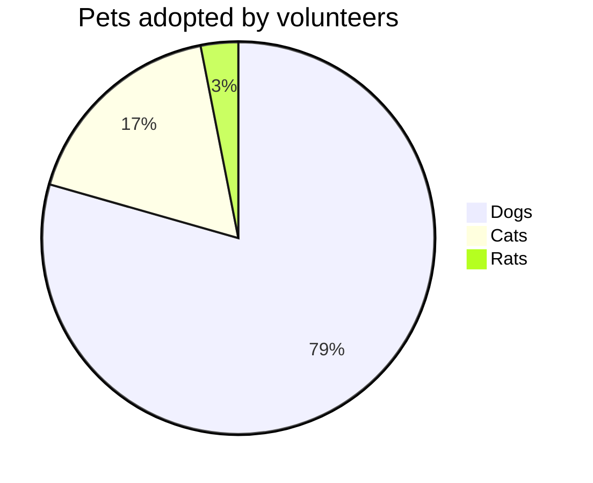

 

 

<!--MERMAID {width:100}-->

<!--MCONTENT {content: "pie title Pets adopted by volunteers \n\"Dogs\" : 386 \n\"Cats\" : 85 \n\"Rats\" : 15 \n\n "} --->

 

This file was generated by Swimm. [Click here to view it in the app](https://swimm-web-app.web.app/repos/Z2l0aHViJTNBJTNBdGVzdC1wcm9qZWN0JTNBJTNBbmFkYXYtc3dpbW0=/docs/pzwm7).
